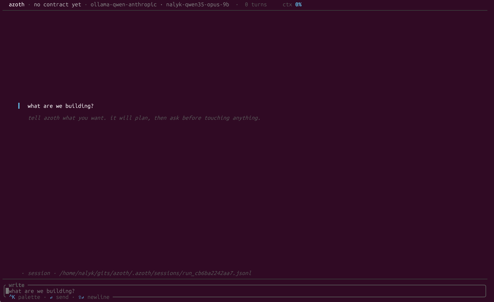
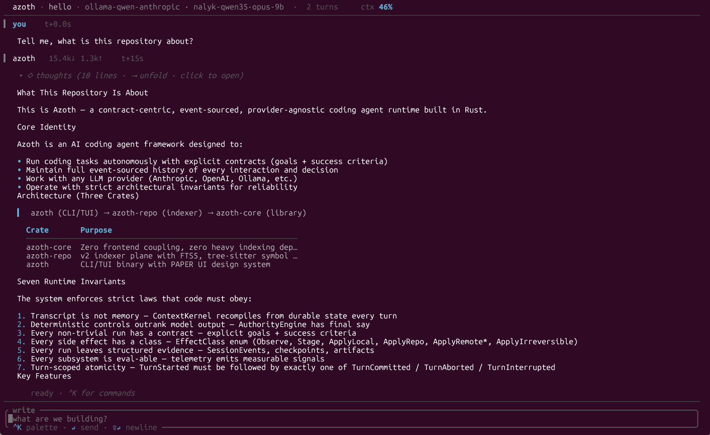

<p align="center">
  
</p>

<h1 align="center">azoth</h1>

<p align="center">
  <a href="https://github.com/nalyk/azoth/releases/latest"></a>
  <a href="https://github.com/nalyk/azoth/releases"></a>
  <a href="#license"></a>
  <a href="https://github.com/nalyk/azoth/attestations"></a>
  <a href="rust-toolchain.toml"></a>
  <a href="https://github.com/nalyk/azoth/releases/latest"></a>
</p>

**Most CLI coding agents are chatbots with shell access. Azoth is a runtime that happens to host a model.**

Every turn runs under a contract with explicit success criteria. Every side effect is classified into one of seven effect classes and budgeted against that contract. Bash runs inside a Landlock jail when you turn the sandbox on. Every run leaves a replayable JSONL event log, a SQLite mirror, and a content-addressed artifact store. The model proposes. The runtime decides.

Rust workspace. Interactive TUI. Linux only. v2.0.2 ships fmt + clippy clean, the full workspace test suite green on Linux x86_64, and SLSA v1.0 build provenance attached.

<p align="center">
  <a href="assets/start_screen.png"></a>
  <br>
  <sub><em>Fresh session. Empty contract, 0 turns, the composer waits for your first prompt.</em></sub>
</p>

<p align="center">
  <a href="assets/main_screen.png"></a>
  <br>
  <sub><em>Live turn. Collapsible thoughts, rendered markdown (headings, lists, GFM tables), per-turn usage chip, whisper row.</em></sub>
</p>

---

## Why this exists

Every CLI coding agent you have tried ships with four assumptions you never agreed to.

**The conversation is memory.** When you send the next message, the whole chat history gets shipped back to the model, and that history is the only record of what happened. If something went wrong, you scroll. If the process crashed, the run is gone. The transcript is both the memory and the audit log, which means it is neither.

**The model is the authority.** When the model decides to write a file, the file gets written. When it decides to run a shell command, the command runs. Approval prompts are a speed bump, not a policy. There is no separation between what the model wants and what the system permits.

**Effects are undifferentiated.** Reading a file and rewriting your filesystem are treated as the same class of thing: a tool call. There is no budget, no taxonomy, no difference between `observe` and `apply_irreversible`. A run that was supposed to answer a question can, in practice, overwrite your repo.

**Retrieval is a wrapper around grep.** You ask about "the function that handles webhook retries" and the agent shells out `rg retries`, pastes the first two thousand lines into the context, and hopes.

Azoth was written by someone who stopped accepting those four assumptions and built the runtime that refuses them.

---

## What Azoth refuses to do

**It will not treat your transcript as memory.** The `ContextKernel` recompiles each request from durable state. The JSONL log is authoritative; the in-memory view is derived. `/resume <run_id>` rebuilds a session from state, not from conversation scrollback. You can delete the process, keep the `.azoth/` directory, and pick up exactly where the last committed turn left off.

**It will not let the model decide whether to write a file.** The `AuthorityEngine` holds the capability tokens. Every tool call passes through a dispatcher that checks approvals and effect-class policy before the shell ever sees a command. `y / s / n` at the approval modal means *once / session / deny*, and the session grant is a typed token in memory, not a convention.

**It will not let bash escape your filesystem when the sandbox is on.** `AZOTH_SANDBOX=tier_a` spawns bash inside an unprivileged user namespace, a net namespace, and a Landlock V2 policy. `tier_b` adds a `fuse-overlayfs` merged mount so writes stage on success and discard on failure. Tested against symlink escape, absolute-target escape, and FIFO stage-back hangs. See the tests section for names.

**It will not forget what it did.** Every turn emits `turn_started` and exactly one of `turn_committed`, `turn_aborted`, or `turn_interrupted`. Tool outputs, packet evidence, and artifacts over a few kilobytes are content-addressed by SHA256 and stored out of band. `azoth replay <run_id> --forensic` reconstructs the whole run, including aborted turns, with `non_replayable: true` annotations where reuse would be unsafe.

**It will not pretend retrieval is solved.** Four lanes — full-text FTS5, tree-sitter symbols, ripgrep, and co-edit graph — feed a Reciprocal Rank Fusion reranker under a per-lane token budget. The graph-lane seed extractor strips `path:line:col` suffixes before querying, because compiler output was never a valid query and pretending it was wastes context. FTS snippets are byte-normalised for cache-prefix stability across reindex.

---

## Seven invariants

The runtime enforces these at all times. A code path that violates any invariant is a bug, regardless of whether it compiles.

1. **The transcript is not memory.** `ContextKernel` recompiles each request from durable state. No transcript replay.
2. **Deterministic controls outrank model output.** `AuthorityEngine` has final say on approvals, capability tokens, and effect budgets.
3. **Every non-trivial run has a contract** with explicit success criteria and a side-effect budget.
4. **Every side effect has a class.** One of `observe`, `stage`, `apply_local`, `apply_repo`, `apply_remote_reversible`, `apply_remote_stateful`, `apply_irreversible`.
5. **Every run leaves structured evidence.** JSONL session, SQLite mirror, content-addressed artifacts.
6. **Every subsystem is eval-able.** Retrieval quality, validator outcomes, and impact-selector decisions all emit measurable signals.
7. **Turn-scoped atomicity.** Every turn emits `turn_started` followed by exactly one of `turn_committed`, `turn_aborted`, or `turn_interrupted`.

These are not aspirations. They are enforced at the type system, the event store, and the runtime scheduler. If you can find a path where a turn commits without a terminator event, or where the `AuthorityEngine` is bypassed, that is a bug you should file.

---

## Architecture

Three crates, strict one-way dependency arrow:

```
azoth (bin, TUI + CLI)
  └── azoth-repo (indexer plane: FTS5, symbols, co-edit graph, TDAD)
        └── azoth-core (runtime library, zero frontend deps)
```

`azoth-core` has zero heavy-indexer deps. Tree-sitter, `rusqlite+FTS5`, git shell-out, and the TDAD back-ends all live in `azoth-repo`. This is not a style choice. It means you can embed the runtime in another host without dragging a tree-sitter grammar compile into your dependency graph.

### The turn pipeline

```
User input / Contract goal
        │
        ▼
TurnDriver.drive_turn()
  ├─ plan      gather contract + last checkpoint
  ├─ compile   ContextKernel builds a 5-lane packet
  │            (constitution · working_set · evidence · checkpoint · exit_criteria)
  ├─ invoke    ProviderAdapter.invoke() streams into mpsc(64)
  ├─ dispatch  ToolDispatcher extracts typed input, taint-gates,
  │            routes through SandboxPolicy, runs Tool::execute
  ├─ validate  ContractGoal, Impact, project-local validators
  └─ commit    JsonlWriter fsyncs, SqliteMirror indexes, artifacts
               land by SHA256, turn_committed emitted
```

The packet is not a prompt. It is a five-lane structured context: the constitution (what the agent is), the working set (what it is holding), the evidence (what the repo looks like for this query, fused across four lanes), the checkpoint (where the last committed turn left off), and the exit criteria (what counts as success). Adapters serialise this into provider-specific message shapes. The packet itself is schema-typed Rust.

### The repo intelligence plane

Four lanes feed the `evidence` lane of each packet. A `ReciprocalRankFusion` reranker merges them under a per-lane-floor token budget, so the lexical lane cannot starve the graph lane even when a query has many literal matches.

| Lane      | Backend                                     | Query shape                      |
|-----------|---------------------------------------------|----------------------------------|
| `graph`   | `CoEditGraphRetrieval` (git log)            | co-edit neighbours of seed paths |
| `symbol`  | `SqliteSymbolIndex` (tree-sitter, Rust)     | exact / fuzzy identifier lookup  |
| `lexical` | `RipgrepLexicalRetrieval` (fixed strings)   | literal substring across repo    |
| `fts`     | `FtsLexicalRetrieval` (SQLite FTS5 porter)  | tokenised full-text              |

The graph lane answers "what else tends to change when this file changes" without ever parsing a line of code. The symbol lane answers "where is `ContextKernel` defined, used, referenced." The two lexical lanes cover the long tail of literal matches and tokenised phrase search. Fusion is RRF, not a hand-tuned linear blend, so lane independence is preserved.

None of this replaces an embedding lane for pure natural-language queries. See the honest-limits section below.

---

## Sandbox and effect classes

Two orthogonal safety planes: one deterministic (effect classes + capability tokens), one enforcement (Linux sandbox). You can run either without the other. Both together is the intended configuration for anything touching code you care about.

### Effect classes

Every tool declares its effect class at registration. The dispatcher refuses to route a call whose class the active contract has not budgeted for.

| Class                      | Examples                                         |
|----------------------------|--------------------------------------------------|
| `observe`                  | `repo_search`, `repo_read_file`, `repo_read_spans` |
| `stage`                    | writes into the overlay, pre-commit                |
| `apply_local`              | `fs_write`, `bash`                                 |
| `apply_repo`               | git operations on the working tree                 |
| `apply_remote_reversible`  | opening a draft PR, tagging                        |
| `apply_remote_stateful`    | pushing a commit                                   |
| `apply_irreversible`       | publishing, releasing, destructive remote ops      |

A contract that says `budget: { apply_local: 3, apply_repo: 0 }` means the model gets three local writes and zero git commits. The dispatcher is the boundary, not a convention.

### Sandbox tiers

Opt in via `AZOTH_SANDBOX`.

| Value             | Mechanism                                                                                                                                  |
|-------------------|--------------------------------------------------------------------------------------------------------------------------------------------|
| (unset) / `off`   | No sandbox. Tools run in the azoth process. (Default.)                                                                                     |
| `tier_a`          | Unprivileged user-ns + net-ns + Landlock V2 FS rules.                                                                                      |
| `tier_b`          | Tier A + `fuse-overlayfs` merged mount of the repo; bash's cwd is the merged view. Writes stage back on success; failed runs discard.      |

Graceful degradation: `tier_b` → (no `fuse-overlayfs`) → `tier_a` → (no user-ns) → `off` → (jail setup fails at spawn) → `off`. Every downgrade logs a `tracing::warn` to `.azoth/azoth.log`. If your kernel cannot support the tier you asked for, you will find out in the log. Azoth will not silently pretend.

Tier-B example:

```bash
AZOTH_SANDBOX=tier_b cargo run
# in the TUI:
#   /contract verify sandbox
#   bash: echo hello > hello.txt && rm old.txt
# stage_overlay_back copies hello.txt into the repo and propagates the
# rm as a whiteout. out.staged_files = ["hello.txt"],
# out.removed_files = ["old.txt"].
```

`BashOutput.staged_files` and `removed_files` are empty under `off` and `tier_a` (writes go directly to the real repo, because there is no overlay to stage from).

---

## Honest status

This section exists because the rest of the README is confident and you deserve to know what it is confident *about*.

### What works end-to-end

- Drive a real coding agent from a terminal against Anthropic, OpenAI, OpenRouter, or a local Ollama endpoint.
- Contract-driven turns commit or abort. Sessions persist as JSONL. `/resume` brings back a prior session with full forensic detail.
- Four-lane composite retrieval (FTS5 full-text, tree-sitter symbols, ripgrep, co-edit graph) with RRF fusion and per-lane token budget.
- Opt-in Linux sandbox (`AZOTH_SANDBOX=tier_a|tier_b`) puts bash inside user-ns + net-ns + Landlock, with optional `fuse-overlayfs` for Tier-B stage-and-commit.
- TDAD test-impact selection via `cargo test --list` (opt-in, `AZOTH_IMPACT_ENABLED=true`) surfaces only the tests a given diff actually exercises.
- `azoth eval run --live-retrieval <repo>` scores the retrieval plane against a seed corpus with localization@k.

### What is deliberately limited

- **Retrieval is keyword-grade for prose queries.** The composite works well when the prompt contains identifiers or paths. Natural-language "explain what happens when X" prompts lose signal. A query-planning and embedding lane is v2.5 scope.
- **`AZOTH_SANDBOX` defaults to off.** The jail imposes a ~100 ms overhead per tool call and needs unprivileged user namespaces (check with `unshare -U true`). Opt in when you want the enforcement.
- **Tree-sitter symbols: Rust only.** Python, TypeScript, Go, and Java grammars are v2.1 scope. Other languages still get FTS, ripgrep, and co-edit graph.
- **TDAD: `cargo test` only.** pytest, jest, and `go test` adapters are v2.1 scope.
- **Linux only.** Sandbox tiers and `fuse-overlayfs` are Linux-specific. macOS and Windows builds currently fail at the `sandbox` module. WSL2 works.
- Contract amendments, the policy DSL, gVisor (Tier C), Firecracker (Tier D), domain packs, and enterprise deployment modes are all post-v2 scope per `docs/draft_plan.md`.

Nothing above is a surprise. All of it is in the v2 plan. The things that are not shipped are named.

---

## Who this is for

You have a coding agent writing to a repo that actually matters, and you need a forensic record of what it did. You want `bash` in a jail, not in a polite request. You want to say "this run can read anything, stage local writes, and push nothing," and you want the runtime to enforce that, not the model. You want to replay a failure three months later from the JSONL log and see exactly which packet produced which tool call. You are comfortable with a TUI, a Linux host, and configuration via env vars.

## Who this is not for

You want a VSCode sidebar, zero-config magic, or macOS-native support. You want to ship a prompt and let the agent figure out the rest. You are happy with chat-as-memory and approval prompts as convention. For those cases, use Claude Code or aider. Both are good at what they do. Azoth is not trying to be them.

---

## Requirements

- Rust 1.80+ stable
- Linux (tested on kernel 5.15+, WSL2 works)
- Optional: `fuse-overlayfs` on PATH for Tier-B sandbox
- Optional: `cargo` on PATH for TDAD impact selection

## Build

```bash
cargo build --release
```

## Quickstart

```bash
# Local Ollama (default profile, no API key needed)
cargo run

# Anthropic
AZOTH_PROFILE=anthropic ANTHROPIC_API_KEY=sk-ant-... cargo run

# OpenRouter with a specific model
AZOTH_PROFILE=openrouter \
  AZOTH_MODEL=openrouter/quasar-alpha \
  OPENROUTER_API_KEY=sk-or-v1-... \
  cargo run

# Resume a prior session
cargo run -- resume <run_id>

# Replay or export a prior session for forensics
cargo run -- replay <run_id> --format json
cargo run -- export <run_id> --format markdown --output transcript.md

# Eval sweep (seed-vs-seed baseline)
cargo run -- eval run --seed docs/eval/v2_seed_tasks.json --k 5

# Eval sweep against live retrieval
cargo run -- eval run --seed docs/eval/v2_seed_tasks.json --k 5 --live-retrieval .
```

## Provider profiles

| Profile                  | Adapter                | Default endpoint                     | Auth env                                                      |
|--------------------------|------------------------|--------------------------------------|---------------------------------------------------------------|
| `ollama-qwen-anthropic`  | AnthropicMessages      | `http://localhost:11434`             | (none)                                                        |
| `ollama-qwen-openai`     | OpenAiChatCompletions  | `http://localhost:11434/v1`          | (none)                                                        |
| `anthropic`              | AnthropicMessages      | `https://api.anthropic.com`          | `ANTHROPIC_API_KEY` (also accepts OAuth `sk-ant-oat01-*`)     |
| `openai`                 | OpenAiChatCompletions  | `https://api.openai.com/v1`          | `OPENAI_API_KEY`                                              |
| `openrouter`             | OpenAiChatCompletions  | `https://openrouter.ai/api/v1`       | `OPENROUTER_API_KEY`                                          |

Per-session overrides: `AZOTH_BASE_URL`, `AZOTH_MODEL`, `AZOTH_API_KEY`.

## Retrieval configuration

| Env                       | Default      | Meaning                                                                                                     |
|---------------------------|--------------|-------------------------------------------------------------------------------------------------------------|
| `AZOTH_RETRIEVAL_MODE`    | `composite`  | `composite` fuses four lanes via RRF; `legacy` is single-lane lexical.                                      |
| `AZOTH_LEXICAL_BACKEND`   | `fts`        | `fts` (SQLite FTS5), `ripgrep`, `both` (composite uses both lanes), `ripgrep_fallback` when FTS unavailable.|
| `AZOTH_IMPACT_ENABLED`    | `false`      | `true` wires `CargoTestImpact` so validators run only tests impacted by the turn's diff.                    |

## Tools (all shipped)

| Tool              | Effect class   | Description                                                          |
|-------------------|----------------|----------------------------------------------------------------------|
| `repo_search`     | Observe        | Literal substring search via ripgrep (honours `.gitignore`).         |
| `repo_read_file`  | Observe        | Read a file by path with optional line range.                        |
| `repo_read_spans` | Observe        | Batch read multiple named line ranges.                               |
| `fs_write`        | ApplyLocal     | Write a file inside the repo root; approval required.                |
| `bash`            | ApplyLocal     | Run a shell command with timeout + cancellation; sandbox-aware.      |

Tool names are ASCII snake-case to satisfy the Anthropic Messages API regex `^[a-zA-Z0-9_-]{1,128}$` (`ToolDispatcher::register` enforces).

## TUI controls

| Key                 | Action                                               |
|---------------------|------------------------------------------------------|
| Enter               | Send the current message                             |
| Alt+Enter           | Newline (multi-line input)                           |
| Up / Down           | Input history (when input is empty)                  |
| Mouse wheel         | Scroll transcript                                    |
| Shift+Up/Down       | Scroll one line                                      |
| Ctrl+Up/Down        | Scroll five lines                                    |
| PageUp / PageDown   | Scroll ten lines                                     |
| Ctrl+End            | Jump to bottom (auto-scroll)                         |
| y / s / n           | Grant once / grant session / deny (approval modal)   |
| Ctrl+C              | Cancel current turn / quit                           |

## Slash commands

| Command             | Description                                                                   |
|---------------------|-------------------------------------------------------------------------------|
| `/help`             | List commands                                                                 |
| `/status`           | Run ID, session path, turn count, active contract                             |
| `/context`          | Show the latest compiled context packet summary                               |
| `/contract <goal>`  | Draft and accept a run contract                                               |
| `/approve [tool]`   | Pre-approve a tool for the session (empty arg lists active capability tokens) |
| `/resume <run_id>`  | Restart into a prior session                                                  |
| `/continue`         | Nudge the model to resume a turn aborted with `reason: "model_truncated"`     |
| `/quit`             | Exit                                                                          |

## CLI subcommands

```
azoth                              # launch TUI (default)
azoth tui                          # explicit TUI launch
azoth resume <run_id>              # resume a session
azoth replay <run_id> [--forensic] [--format text|json] [--sessions-dir <dir>]
azoth export <run_id> [--format markdown|json] [--output <path>] [--sessions-dir <dir>]
azoth version                      # print build info
azoth eval run --seed <path> [--k 5] [--out <path>] [--sessions-dir <dir>]
                                   [--run-id <id>] [--live-retrieval <repo>]
```

`replay` without `--forensic` emits only committed turns (safe for resume context). `replay --forensic` includes aborted and interrupted turns with `non_replayable: true` annotations.

## Session storage

```
.azoth/
  sessions/<run_id>.jsonl    # append-only turn-scoped event log (authoritative)
  state.sqlite               # indexed mirror (rebuildable from JSONL)
  artifacts/<sha256>         # content-addressed blob store
  azoth.log                  # tracing output (TUI writes here; stdout is ratatui)
```

JSONL is authoritative. SQLite is a secondary index rebuildable via `event_store::rebuild_from(jsonl)`. Artifacts are content-addressed by SHA256; tool outputs, packet evidence, and other large payloads are stored out of band and referenced from events. You can lose the SQLite file and nothing is lost that cannot be recomputed.

## Testing

```bash
cargo test --workspace -- --test-threads=1
# 466 passed / 0 failed / 1 ignored
```

Single-threaded because `sandbox_tier_a_smoke` and a few other tests fork, which is fragile under a parallel test-harness runner. Clippy and fmt must stay clean:

```bash
cargo fmt --check
cargo clippy --workspace --tests -- -D warnings
```

Selected integration tests worth knowing about:

- `sandbox_tier_a_smoke` — `spawn_jailed` + `/bin/true` round-trip (skips cleanly without unprivileged user-ns).
- `bash_tier_a_landlock_blocks_write_to_etc_passwd` — empirical proof Landlock denies out-of-sandbox writes.
- `bash_tier_b_stages_writes_back_to_repo_on_success` — overlay commit semantics.
- `bash_tier_b_blocks_symlink_dir_traversal_to_host_files` — security regression guard against `ln -s /etc leak`.
- `bash_tier_b_skips_fifo_entries_without_hanging` — `tokio::time::timeout` bounds a stage-back hang that `std::fs::copy` on a FIFO would introduce.
- `live_retrieval_against_real_tempdir_repo_produces_nonzero_predictions` — end-to-end FTS index build plus composite query over a tempdir repo.

## Project structure

```
azoth/
├── Cargo.toml                    # workspace root
├── crates/
│   ├── azoth-core/               # runtime library, zero frontend + zero heavy-indexer deps
│   │   └── src/
│   │       ├── schemas/          # Contract, Turn, ContentBlock, EffectClass, Origin, etc.
│   │       ├── event_store/      # JSONL dual projection + SQLite mirror + hand-rolled migrator
│   │       ├── artifacts/        # SHA256 blob store
│   │       ├── contract/         # draft, lint, accept
│   │       ├── context/          # ContextKernel, CompositeEvidenceCollector, RRF, token budget
│   │       ├── retrieval/        # LexicalRetrieval, SymbolRetrieval, GraphRetrieval traits
│   │       ├── authority/        # Tainted<T>, SecretHandle, capability tokens, approvals
│   │       ├── sandbox/          # Tier A/B/C/D policy, spawn_jailed, OverlayWorkspace
│   │       ├── execution/        # Tool trait, ErasedTool, ToolDispatcher, ExecutionContext
│   │       ├── tools/            # repo_search, repo_read_file, repo_read_spans, fs_write, bash
│   │       ├── adapter/          # AnthropicMessages, OpenAiChatCompletions, SSE parsers
│   │       ├── turn/             # TurnDriver state machine (biased tokio::select!)
│   │       ├── validators/       # Validator + ImpactValidator + selector-backed variant
│   │       ├── eval/             # localization@k, regression_rate
│   │       └── telemetry/        # structured tracing emitters
│   ├── azoth-repo/               # heavy indexer plane (v2)
│   │   └── src/
│   │       ├── indexer.rs        # RepoIndexer, four-phase incremental reindex
│   │       ├── fts.rs            # FtsLexicalRetrieval, SQLite FTS5 porter unicode61
│   │       ├── code_graph/       # tree-sitter Rust symbol extraction + SqliteSymbolIndex
│   │       ├── history/          # git shell-out, co-edit graph builder, CoEditGraphRetrieval
│   │       └── impact/           # CargoTestImpact, GitStatusDiffSource
│   └── azoth/                    # binary crate (CLI + TUI)
│       └── src/
│           ├── main.rs           # clap, tracing setup
│           ├── eval.rs           # `eval run` subcommand
│           ├── eval_live.rs      # `--live-retrieval` composite builder
│           ├── replay.rs         # `replay` subcommand
│           ├── export.rs         # `export` subcommand
│           └── tui/              # ratatui + crossterm + tui-textarea
│               ├── app.rs        # AppState, biased select! loop, worker task
│               ├── config.rs     # profile registry, env overrides, OAuth
│               ├── render.rs     # frame builder, scrollbar, status line
│               └── widgets/      # approval modal, scrollback, input
├── docs/
│   ├── draft_plan.md             # v1 architecture spec (frozen anchor)
│   ├── v2_plan.md                # v2 plan (repo intelligence moat)
│   ├── eval/                     # seed tasks for localization@k
│   ├── superpowers/              # design docs per feature
│   └── research/                 # upstream research notes
└── .azoth/                       # runtime state (gitignored)
```

## Version history

- **v2.0.2** (current, main). Chronon Plane — invariant #8: *time is taint, not preface*. Every persisted timestamp flows through an injected `Clock` (`SystemClock` in production, `FrozenClock` in tests, `VirtualClock` for replay). Externally-observed facts carry `(observed_at, valid_at)`. Contracts may bound wall-clock spend via `scope.max_wall_secs`; open turns emit throttled `TurnHeartbeat` events. `azoth resume --as-of <ISO8601>` reconstructs a forensic projection at any wall-clock point (m0007 adds the `turns.at` index). Seven bot-review rounds closed.
- **v2.0.1**. Tier-B `stage_overlay_back` symlink-escape hardening. Three rounds: refuse symlinks whose canonical target escapes the merged view; canonicalize against `ws.merged` (not `repo_root`) so same-turn-created targets validate independently of `read_dir` order; refuse every absolute symlink target outright (absolute paths captured from `$PWD` under the ephemeral overlay mount dangle forever post-unmount).
- **v2.0.0**. Composite retrieval, tree-sitter symbols, co-edit graph, TDAD impact, eval plane, sandbox Tier-A/B enforcement on bash, live-retrieval flag, seven bot-review rounds closed.
- **v1.5**. Adapters (Anthropic OAuth + OpenAI), content-block protocol, JSONL dual projection, Tier-A/B sandbox smoke, `ContextKernel` v0, Tools + `ToolDispatcher` + `AuthorityEngine`, TUI MVP.

See `docs/draft_plan.md` for the v1 architecture spec (still the invariant anchor) and `docs/v2_plan.md` for the v2 plan (most items shipped; the `§scope fence` is up-to-date).

## License

Dual-licensed under MIT OR Apache-2.0. See [LICENSE-MIT](LICENSE-MIT) and [LICENSE-APACHE](LICENSE-APACHE).