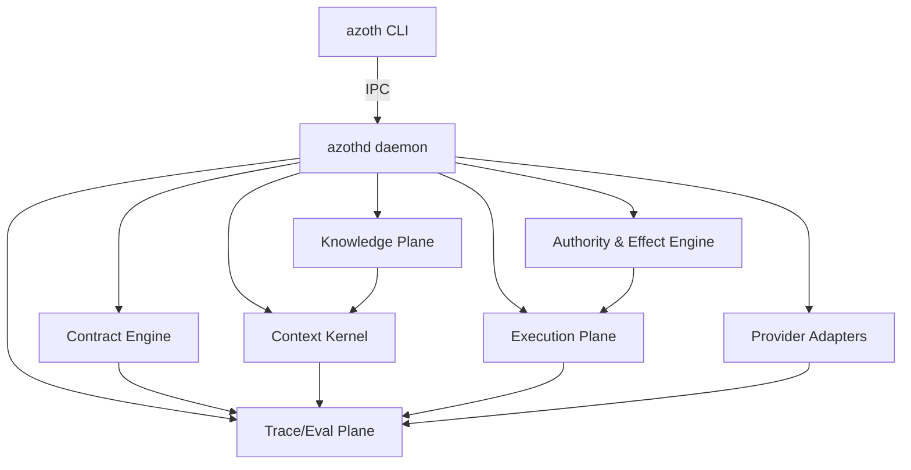
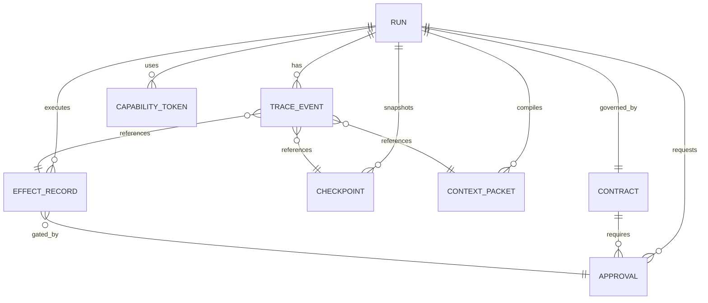
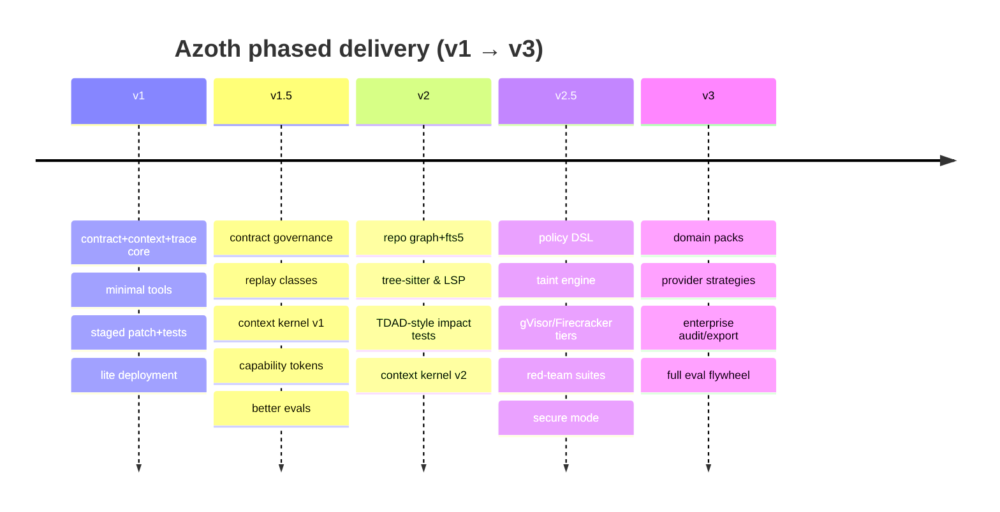

# Azoth Implementation Plan, Fully Specified

## Executive summary

Azoth is a **contract-centric, context-compiled, event-sourced CLI agent runtime** designed to be **provider/model-agnostic**, **coding-first**, and **task-general via domain packs**—without adopting third‑party “agent frameworks.” This plan implements Azoth in five phases (v1 → v3), each deliverable with explicit **features, schemas, APIs, runtime components, security controls, UX flows, deployment modes, tests, eval metrics**, and clear statements of what is **proven (by primary sources), hypothesized, or requires measurement**.

The blueprint is anchored in **primary/official sources**:  
- entity["company","OpenAI","api docs & codex"]’s stateful **Responses API** and Items model (vs message arrays), WebSocket mode, Structured Outputs, caching/compaction, tool use, agent safety guidance, and trace grading/evals. citeturn0search5turn0search2turn0search0turn10search0turn0search6turn10search25turn9search0  
- entity["company","Anthropic","engineering & api docs"]’s guidance on context engineering, long-running harnesses, tool design, and evaluation graders. citeturn1search1turn1search0turn1search2turn1search14turn1search9  
- entity["company","Google","vertex ai genai docs"]’s Vertex AI docs for function calling, response schemas/controlled output, context caching, token counting, and error semantics. citeturn2search1turn2search13turn2search2turn2search12turn12search4  

Key evidence shaping Azoth’s “constitution”:
- **Long transcripts / brute context windows are unreliable** (“Lost in the Middle”). citeturn7search3  
- **Passing tests ≠ mergeability**: maintainers reject ~half of test‑passing SWE‑bench Verified PRs in METR’s study; naive benchmark interpretation overestimates real usefulness. citeturn8search0  
- **Test-time scaling has structural limits**: sequential scaling hits a “context ceiling”; parallel scaling suffers a persistent “verification gap.” citeturn7search6turn7search10  
- **Repo-graph retrieval and impact analysis are high-leverage**: RANGER and TDAD show meaningful gains vs baseline retrieval and regression reduction via graph-based test impact selection. citeturn7search0turn7search1  
- **Structured outputs and prefix caching are mature primitives** (OpenAI Structured Outputs; vLLM structured outputs and prefix caching). citeturn0search0turn3search1turn3search0  
- **Sandboxing & approvals are distinct controls** (Codex); internet access increases prompt injection/exfiltration risk. citeturn10search0turn10search4turn10search1  
- **Linux sandbox primitives are well-defined**: Landlock (ambient rights restriction), seccomp filters (syscall filtering isn’t “a sandbox”), cgroup v2 (resource control). citeturn4search3turn5search0turn5search4turn5search1  
- **Stronger isolation options exist for higher-risk steps**: gVisor (security boundary with overhead) and Firecracker microVMs (KVM-based isolation, minimal device model). citeturn5search6turn5search15turn5search2  

**Terminology / status labels used throughout**
- **Proven**: directly supported by cited primary sources or peer-reviewed/arXiv papers listed in your request.
- **Hypothesis**: plausible design claim; needs validation under Azoth’s workloads.
- **Requires measurement**: can’t be answered credibly without profiling/evals on your target repos and tasks.

## Architecture blueprint and decision tables

Azoth is built around **five invariants** (the “no-human-mistakes constitution”):

1) **Success is a contract, not a model verdict**. Contracts must define success criteria and budgets before action. This is motivated by the mergeability gap found by entity["organization","METR","ai evaluation nonprofit"] and by eval guidance emphasizing explicit criteria and grading. citeturn8search0turn1search14turn0search6  
2) **Context is compiled per step, not accumulated transcripts**. This is directly motivated by long-context positional failures (Lost‑in‑the‑Middle) and by Anthropic’s context-engineering framing. citeturn7search3turn1search1  
3) **Evidence outranks narration**: deterministic validators and policy gates are “law”; model output is advisory. This matches OpenAI agent safety guidance and trace/eval guidance. citeturn10search25turn0search6turn0search3  
4) **All side effects are classified**: approvals, rollback, replay classification, and sandbox tiers depend on effect class (Codex sandbox vs approvals). citeturn10search0turn10search1  
5) **Everything is traced and evaluable**: trace grading and agent evals are first-class, not a post-launch afterthought. citeturn0search3turn0search6turn1search14  

### Core runtime diagram



### Alternatives tables requested

#### Retrieval stack options (repo knowledge plane)

| Option | What it is | Strengths | Weaknesses | When to choose | Evidence |
|---|---|---|---|---|---|
| Lexical first (ripgrep + Git + SQLite FTS5) | Exact/regex search + full-text index | Very fast, cheap, transparent; respects `.gitignore` | Weak on semantic links + cross-file dependency | Always as baseline path | ripgrep behavior citeturn4search2; SQLite FTS5 citeturn3search3 |
| Symbol/graph augmentation (tree-sitter + LSP + SQLite graph) | Build symbol table + dependency edges | Better localization, strongly inspectable | Engineering effort; language coverage varies | Coding-first repos, multi-language | tree-sitter incremental parsing citeturn4search4; LSP provides defs/refs citeturn4search1 |
| Graph-enhanced retrieval agent | Graph + dual-stage retrieval | Strong results on repo tasks | Heavier infra; graph maintenance | v2+ moat | RANGER paper citeturn7search0 |
| Graph-based test impact selection | AST→code-test graph + impact | Cuts regressions; speeds targeted validation | Needs test discovery + graph quality | v2+ for coding workflows | TDAD paper citeturn7search1 |
| Embeddings-first RAG | Chunk embeddings + similarity search | Easy to implement | Often misses entities; less inspectable | Only as fallback for NL-only text | RANGER shows graph/bm25 combos outperform embedding baselines in tasks described citeturn7search0 |

**Proven**: ripgrep ignore behavior, SQLite FTS5 existence, tree-sitter incremental parsing, LSP features, and RANGER/TDAD empirical results. citeturn4search2turn3search3turn4search4turn4search1turn7search0turn7search1  
**Requires measurement**: exact performance of each stack on your repos, languages, and workflows.

#### Sandbox / isolation options

| Tier | Mechanisms | What it protects | Costs | Trigger | Evidence |
|---|---|---|---|---|---|
| Tier A: local process hardening | Landlock + seccomp + cgroup v2 | Restrict filesystem ambient rights; filter syscalls; cap CPU/mem | Low overhead | Observe/Stage, no network | Landlock goal citeturn4search3; seccomp filtering citeturn5search0; “seccomp isn’t a sandbox” warning citeturn5search4; cgroup v2 doc citeturn5search1 |
| Tier B: overlay workspace | overlayfs lower/upper/workdir | Clean rollback, cheap snapshotting | Low-medium | All staged writes/tests | overlayfs mount semantics citeturn11search4turn11search3 |
| Tier C: gVisor | userspace kernel boundary | Defense vs kernel exploit, untrusted code | Medium; overhead acknowledged | Untrusted execution, networked tasks | gVisor security model citeturn5search6turn5search15 |
| Tier D: Firecracker microVM | KVM microVM isolation | Max isolation; reduced attack surface | Higher; requires KVM/Linux | Highest risk: external-service writes, secrets, wide network | Firecracker overview citeturn5search2 |

**Proven**: kernel-primitive definitions and doc claims, gVisor/Firecracker stated goals and overhead/cost framing. citeturn4search3turn5search0turn5search1turn5search6turn5search2  
**Hypothesis**: which tiers are sufficient for your threat model (must be validated with adversarial tests).

#### Local ML runtimes (optional helpers, not required in v1)

| Option | Added value | Hardware cost | Lock-in risk | Evidence |
|---|---|---|---|---|
| None (remote-only) | Simplest; consistent behavior | Lowest | Lowest | (Design choice; no claim) |
| ONNX Runtime helper models | Fast local rerank/classify; cross-platform | Medium | Low | ORT described as cross-platform accelerator citeturn6search0 |
| llama.cpp local LLM | Offline fallback/reviewer; minimal setup | Higher (RAM/CPU/GPU) | Medium | llama.cpp goal: LLM inference with minimal setup on wide hardware citeturn6search1 |
| vLLM self-hosted profile | KV/prefix caching, structured outputs infra | High (GPU server) | Medium | vLLM prefix caching and structured outputs docs citeturn3search0turn3search1 |

**Proven**: ORT and llama.cpp project goals; vLLM features. citeturn6search0turn6search1turn3search0turn3search1  
**Requires measurement**: ROI vs overhead for your workloads.

image_group{"layout":"carousel","aspect_ratio":"16:9","query":["Firecracker microVM architecture diagram","gVisor security architecture diagram","Linux Landlock LSM sandbox diagram","OverlayFS upperdir lowerdir workdir diagram"],"num_per_query":1}

## Prioritized roadmap with sprint-level tasks (v1 → v3)

This section is a build plan written for **junior/mid engineers**. Each sprint includes **acceptance criteria** and **explicit tests**. Each phase also includes **features, schemas, APIs, runtime components, security controls, UX flows, and deployment modes**, as requested.

**Sprint convention**: 2-week sprints. (If you run 1-week sprints, split tasks accordingly—nothing relies on the length.)

### v1: Minimal Governed Coding Agent CLI (proof of architecture)

**Goal**: deliver an end-to-end governed coding loop on a local repo: contract → compile context → propose tool actions → stage changes → run deterministic validators → produce evidence pack → optional apply. This aligns with OpenAI tool semantics (local shell: API does not execute on OpenAI infra) and tool discipline guidance. citeturn10search2turn10search30turn10search5

**v1 features**
- Contract Engine: execution + investigation contract (draft + lint + accept). *(Design, motivated by METR mergeability gap.)* citeturn8search0  
- Context Kernel v0: compile 5-lane ContextPacket per step (constitution/working/evidence/checkpoint/exit). *(Directly motivated by Lost-in-the-Middle + Anthropic context engineering.)* citeturn7search3turn1search1  
- Event store: append-only TraceEvent + artifacts. *(Motivated by OpenAI trace grading.)* citeturn0search3turn0search6  
- Effect classes and approvals: Observe/Stage/Apply-local minimal; approvals separated from sandbox boundaries (Codex concept). citeturn10search0turn10search16  
- Tools v1 (minimal, namespaced): repo.search (ripgrep), repo.read_spans, repo.diff_apply (patch staging), exec.run, exec.tests, vcs.local (worktree/branch ops), approval.request. *(Tool minimalism is consistent with Anthropic tool guidance.)* citeturn1search2turn4search2turn3search2  
- Provider adapter v1: implement one provider first; but internal protocol must be provider-agnostic (OpenAI Responses Items model informs external mapping). citeturn0search5turn9search4  
- Deployment modes: **Lite mode** only (local daemon + local artifacts + remote model calls). *(Hardware constraint.)*

**v1 security controls**
- Default: no network for exec plane unless explicitly approved (Codex “internet increases risk”). citeturn10search4turn10search11  
- Tier A sandbox baseline on Linux: Landlock + seccomp + cgroup v2 when available; fall back gracefully when not available. citeturn4search3turn5search0turn5search1  
- Taint marking: mark web/tool outputs as untrusted (prompt injection risk) per OpenAI safety guide. citeturn10search25turn10search4  

**v1 UX flows**
- Contract drafting wizard (CLI): show intent, success criteria, scope, budgets; require explicit acceptance.
- Approval prompts: “approve once / for session” semantics (mirrors Codex approvals UX). citeturn10search16turn10search0  
- Evidence pack on any proposed apply: diff summary + tests run + logs references + risk flags.

**v1 tests + eval metrics**
- Unit tests: schema validation, policy decisions deterministic, event store append.
- Integration tests: run on a small demo repo to perform: search → patch → test → stage.
- Trace graders v0: tool choice correctness, contract adherence, scope violation detection (OpenAI trace grading guidance). citeturn0search3turn0search6  
- Metrics: contract acceptance rate, number of out-of-scope attempts blocked, tests pass rate, time-to-first-successful-stage, tokens per step.

**v1 sprint plan**

| Sprint | Deliverables | Acceptance criteria (must be automated) | Proven vs needs measurement |
|---|---|---|---|
| v1-S1 | Daemon skeleton + SQLite store + artifact store | `azothd` starts; creates run; writes TraceEvent rows; artifacts content-addressed; crash-restart preserves state | SQLite/FTS5 proven; performance needs measurement citeturn3search3 |
| v1-S2 | Schemas v1 + contract CLI flow | Contract must pass schema validation; lint rules enforce non-empty success criteria; accepted contract is immutable version | Contract lint value is hypothesis; needs measurement against real tasks citeturn8search0 |
| v1-S3 | Context compiler v0 + minimal tools | Each step produces ContextPacket with ≤ token budget; ripgrep search respects `.gitignore`; read spans stable | ripgrep behavior proven citeturn4search2; packing heuristics need measurement |
| v1-S4 | Stage/apply pipeline + validators | Apply patch in overlay; run tests; only promote to workspace when validators pass | overlayfs semantics proven citeturn11search4; test selection tuning needs measurement |
| v1-S5 | Approvals + basic sandbox hardening | Apply-local requires approval; Landlock/seccomp enabled on Linux; failing calls blocked | Landlock/seccomp existence proven citeturn4search3turn5search0; real security requires red-team |
| v1-S6 | Provider adapter v1 + trace graders v0 | One provider can run end-to-end; trace grading produces score and annotations | OpenAI trace grading proven citeturn0search3; grader quality requires measurement |

### v1.5: Hardening and “contract truthfulness”

**Why this phase exists**: v1 proves architecture, but risks remain: contract rubber‑stamping, context rot, approval fatigue, replay confusion. Anthropic explicitly treats long-running coherence as an open problem and promotes harness/artifacts; OpenAI promotes traces/graded evals. citeturn1search0turn0search6  

**v1.5 features**
- Contract governance: amendments with diffs; contract templates; contract linter v2.
- Replay classification per event: deterministic / bounded-drift / record-only.
- Context Kernel v1: “lost-in-middle” packing rules; stable-prefix policy for caching.
- Add prompt caching support (where provider supports it): stable constitution prefix (OpenAI prompt caching). citeturn9search0  
- Approval fatigue mitigation: scoped capability tokens (session-limited) rather than repeated prompts (Codex approvals concept; Anthropic notes on permission prompt dynamics). citeturn10search16turn1search6  

**v1.5 deployment modes**
- Still Lite by default, plus “Standard” toggles (incremental indexing, better validators).

**v1.5 tests & metrics**
- Contract amendment rate; “contract drift” metric (success criteria changed after failures).
- Context compiler regression test suite: same task, multiple packet shapes—measure validator pass rate.
- Approval quality metrics: approvals requested per run; approvals granted; dangerous approvals flagged.

### v2: Repo intelligence moat (graph + impact testing)

**Motivation**: RANGER demonstrates strength of graph-enhanced repository retrieval, and TDAD shows regression reduction via AST/code-test graph impact analysis. citeturn7search0turn7search1  

**v2 features**
- Knowledge Plane v2:
  - tree-sitter extraction for syntax trees & symbol table (incremental parsing). citeturn4search4  
  - LSP integration for definitions/references/diagnostics. citeturn4search1  
  - co-edit graph from Git history (files that change together). *(Requires measurement on your repos; technique is common but not “proven best” universally.)*  
  - SQLite FTS5 indexing for docstrings, identifiers, readme fragments. citeturn3search3  
- Test impact selection algorithm (TDAD-inspired): build code-test graph; compute affected tests; run targeted set first. citeturn7search1  
- Context Kernel v2: retrieval order enforcement (graph → lexical → FTS5 → rerank) and token budgeting.
- Optional: self-hosted profile for open models (vLLM) if needed; adds prefix caching & structured outputs capabilities. citeturn3search0turn3search1  

**v2 security controls**
- Expand taint model: mark repo-origin data vs web-origin vs connector-origin; forbid tainted strings from becoming privileged tool arguments without deterministic validation (OpenAI prompt injection risk framing). citeturn10search25turn10search4  

**v2 eval metrics**
- Localization accuracy (time to identify correct file/module), regression rate (tests broken), resolution rate, cost per resolved task (SWE-bench harness provides a standard evaluation model). citeturn8search7turn8search5  
- Add “mergeability proxy” metric: style/quality graders + maintainers-in-the-loop sampling (motivated by METR). citeturn8search0  

### v2.5: Security maturity (taint flow, policy DSL, higher isolation)

**Motivation**: OpenAI and Anthropic both emphasize prompt injection and tool security; Codex docs explicitly warn that enabling internet increases risk; Linux primitives define hard boundaries. citeturn10search4turn10search25turn5search4turn4search3  

**v2.5 features**
- Policy DSL for capabilities and approvals (examples below), compiled into deterministic checks.
- Tiered sandbox triggers: gVisor for untrusted/networked tasks; Firecracker microVM pool for highest risk actions. citeturn5search6turn5search2  
- Secret handling: “secret handles” only; prevent raw secrets from entering model context (design principle; requires implementation + red-team verification).
- Red-team harness: injection cases, exfiltration attempts, sandbox escape probes.

**v2.5 deployment modes**
- Add **Secure mode**: central policy enforcement; remote runner for risky steps; enterprise audit exports.

### v3: Full-featured Azoth (domain packs + enterprise-grade governance + provider strategy)

**Motivation**: Need long-running, multi-domain capability with measured eval flywheel and explicit governance, aligned with agent-evals, trace grading, and context management best practices. citeturn0search6turn1search0turn1search1  

**v3 features**
- Domain Packs: coding (default), research, ops. Each pack defines contract templates, validators, tools, evidence formats.
- Provider profiles (OpenAI/Anthropic/Google) fully mapped with: state, caching, structured output, function calling, quotas/errors, token accounting. citeturn0search1turn9search0turn1search9turn2search1turn2search13turn12search4  
- Migration / backward compatibility: provider changes do not break internal protocol; runs remain replay-inspectable.
- Full eval harness: offline datasets + trace graders + production dashboards.

## Core schemas and internal protocol

Below are **detailed schemas** in YAML (human-friendly) and JSON Schema orientation notes. These are **design artifacts**, motivated by structured-output reliability (OpenAI Structured Outputs; Vertex response schema; vLLM structured outputs). citeturn0search0turn2search13turn3search1  

### Contract (YAML)

```yaml
Contract:
  schema_version: "1.0"
  contract_id: "ctr_..."
  run_id: "run_..."
  type: "execution" # or "investigation"
  title: "Fix token refresh rejection"
  intent_statement: "..."
  created_at: "2026-04-15T10:00:00Z"
  created_by:
    actor_type: "human" # human|agent|automation
    actor_id: "user:local"
  acceptance:
    status: "draft" # draft|accepted|rejected|amended|completed|failed|abandoned
    accepted_at: null
    accepted_by: null
    amendment_of: null

  scope:
    in_scope_paths:
      - "src/auth/**"
    forbidden_paths:
      - ".git/**"
      - "infra/prod/**"
    allowed_languages: ["python", "typescript"]
    allowed_tools:
      - "repo.search"
      - "repo.read_spans"
      - "repo.diff_apply"
      - "exec.tests"
      - "vcs.local"
    notes: "Scope must be amended before touching middleware/."

  success_criteria:
    - id: "sc_1"
      kind: "deterministic"
      description: "Fail-to-pass test(s) now pass"
      validator_ref: "validator:test_suite"
    - id: "sc_2"
      kind: "deterministic"
      description: "No new test failures outside impacted set"
      validator_ref: "validator:impact_tests"
    - id: "sc_3"
      kind: "human_signoff"
      description: "Code review approval required for remote PR"
      validator_ref: "approval:final_signoff"

  regression_envelope:
    policy: "no_new_failures" # no_new_failures|bounded|custom
    allowed_failures: []
    performance_budget:
      max_regression_pct: 2.0
      benchmarks: ["bench/auth_flow"]

  budgets:
    wall_clock_seconds: 3600
    token_budget_total: 200000
    dollar_budget: 30.00
    max_steps: 120
    max_parallel_branches: 3

  effect_budget:
    allow_network:
      default: false
      allowlist_domains: ["pypi.org", "files.pythonhosted.org"]
      allowed_methods: ["GET", "HEAD"]
    allow_package_installs: false
    allow_remote_vcs: false
    allow_external_services: false

  signoff_policy:
    require_human_for_effect_classes:
      - "apply_repo"
      - "apply_remote_reversible"
      - "apply_remote_stateful"
      - "apply_irreversible"
    allow_autonomous_within_scope: true
    final_signoff_required: true

  notes_for_agent: "Prefer reproduction + minimal diff; run targeted tests first."
  notes_for_humans: "Azoth will propose a staged patch and run tests before requesting apply."
```

### Checkpoint (YAML)

```yaml
Checkpoint:
  schema_version: "1.0"
  checkpoint_id: "chk_..."
  run_id: "run_..."
  parent_checkpoint_id: null
  created_at: "2026-04-15T10:05:00Z"

  state_fingerprints:
    repo:
      head_commit: "abcdef123"
      dirty_tree_hash: "sha256:..."
      worktree_path: "/path/to/worktree"
    environment:
      os: "linux"
      sandbox_tier: "tier_a"
      tool_versions:
        rg: "14.1.1"
        git: "2.45.0"
    provider:
      profile_id: "openai-default"
      model_id: "gpt-5.4"
      model_version_hint: "2026-03-xx"

  working_state:
    active_hypothesis: "Token validation now rejects refreshed tokens due to expiry parsing."
    touched_paths:
      - "src/auth/tokens.py"
    pending_tasks:
      - "Reproduce failing test"
      - "Locate validation function"
    blockers:
      - type: "missing_permission"
        detail: "Network disabled; cannot fetch docs"
    pending_approvals: []

  evidence_refs:
    - artifact_id: "art_..."
      kind: "test_log"
      description: "pytest output failing test_token_refresh"
    - artifact_id: "art_..."
      kind: "file_span"
      description: "tokens.py validate_token() excerpt"

  last_validators:
    - validator_id: "validator:impact_tests"
      status: "fail"
      report_artifact: "art_..."

  next_safe_entrypoint:
    step_kind: "observe"
    suggested_action: "repo.search"
    query: "validate_token refresh"
```

### ContextPacket (YAML)

```yaml
ContextPacket:
  schema_version: "1.0"
  packet_id: "ctx_..."
  run_id: "run_..."
  step_id: "step_..."
  created_at: "2026-04-15T10:06:00Z"
  token_budget:
    max_input_tokens: 18000
    reserved_for_output: 2000
    reserved_for_reasoning: 4000 # if provider supports reasoning effort
  lanes:
    constitution_lane:
      contract_ref: "ctr_..."
      tool_schemas_ref: "art_tools_..."
      policy_ref: "pol_..."
    working_set_lane:
      - artifact_ref: "art_diff_..."
      - artifact_ref: "art_fail_test_..."
    evidence_lane:
      - artifact_ref: "art_span_tokens_py_..."
      - artifact_ref: "art_lsp_diag_..."
    checkpoint_lane:
      checkpoint_ref: "chk_..."
      compact_summary: "..."
    exit_criteria_lane:
      - "Run impacted tests; ensure sc_1, sc_2 satisfied."
  compiler_telemetry:
    candidates_considered: 132
    selected: 19
    dropped: 113
    retrieval_routes_used: ["graph", "lexical", "fts5"]
    estimated_hit_probability: 0.72
```

### EffectRecord (YAML)

```yaml
EffectRecord:
  schema_version: "1.0"
  effect_id: "eff_..."
  run_id: "run_..."
  step_id: "step_..."
  effect_class: "stage" # observe|stage|apply_local|apply_repo|apply_remote_reversible|apply_remote_stateful|apply_irreversible
  tool_name: "repo.diff_apply"
  sandbox_tier: "tier_b"
  capability_required: "cap_stage_write"
  approval:
    required: true
    approval_id: "apr_..."
  rollback:
    protocol: "overlay_discard" # overlay_discard|git_reset|artifact_restore|revert_commit|manual
  replay:
    class: "deterministic" # deterministic|bounded_drift|record_only
  started_at: "..."
  finished_at: "..."
  outputs:
    result_artifact: "art_..."
    changed_paths: ["src/auth/tokens.py"]
```

### TraceEvent (YAML)

```yaml
TraceEvent:
  schema_version: "1.0"
  event_id: "evt_..."
  run_id: "run_..."
  step_id: "step_..."
  timestamp: "..."
  type: "tool_call" # contract|context_packet|tool_call|tool_result|validator|approval|checkpoint|error|rollback|commit
  refs:
    contract_id: "ctr_..."
    checkpoint_before: "chk_..."
    checkpoint_after: "chk_..."
    context_packet_id: "ctx_..."
    effect_id: "eff_..."
    approval_id: "apr_..."
  replay_class: "bounded_drift"
  artifacts:
    - "art_..."
  metadata:
    provider: "openai"
    model: "gpt-5.4"
    request_id: "prov_req_..."
```

### CapabilityToken (YAML)

```yaml
CapabilityToken:
  schema_version: "1.0"
  token_id: "cap_..."
  issued_to_run: "run_..."
  issued_by: "human:user:local"
  issued_at: "..."
  expires_at: "..."
  scope:
    allowed_effect_classes: ["observe", "stage", "apply_local"]
    allowed_tools: ["repo.*", "exec.tests", "vcs.local"]
    path_allowlist: ["src/**", "tests/**"]
    network:
      enabled: false
      domains: []
    max_bytes_written: 10485760
  revocation:
    revoked: false
    revoked_at: null
    reason: null
```

### Approval (YAML)

```yaml
Approval:
  schema_version: "1.0"
  approval_id: "apr_..."
  run_id: "run_..."
  requested_at: "..."
  requested_by_step: "step_..."
  request:
    effect_class: "apply_local"
    summary: "Apply staged diff to workspace"
    evidence_pack:
      diff_artifact: "art_diff_..."
      tests_artifact: "art_tests_..."
      risks: ["Touches auth token validation"]
  decision:
    status: "pending" # pending|approved|denied|expired
    decided_at: null
    decided_by: null
    scope_granted:
      grant_type: "approve_once" # approve_once|session_scope|scoped_once
      expires_at: null
```

**Validation note (proven)**: schema-constrained generation is now a mainstream primitive in OpenAI Structured Outputs and Google response schemas, reducing malformed outputs and enabling robust tool flows. citeturn0search0turn2search13  
**Hypothesis**: your exact schema fields are optimal; you must iterate based on trace grading and production feedback. citeturn0search3turn0search6  

## APIs, daemon/CLI spec, and provider adapters

### Azoth CLI (user-facing) commands

Azoth CLI is intentionally **boring** (boring ships). Commands map to run lifecycle and approval.

- `azoth init`  
  Creates `.azoth/` in repo, initializes config and local DB pointer.
- `azoth run`  
  Starts a run from a prompt; launches contract drafting.
- `azoth status`  
  Shows run status and last checkpoint.
- `azoth approve [approval_id] --once|--session|--scope=…`  
  Grants requested approval.
- `azoth replay run_id [--strict|--approx]`  
  Replays deterministic events; displays record-only events.
- `azoth export run_id --format=jsonl|otel`  
  Exports trace for audit/evals.

### Azoth daemon (azothd) IPC API

Use **HTTP over Unix domain socket** by default (simple) and optional TCP+TLS for team/enterprise.

**Auth**  
- Local mode: OS-level socket permissions + optional bearer token file.  
- Team/enterprise: mTLS + signed capability tokens.

**Error codes**  
Azoth normalizes provider errors into a stable internal set, informed by provider error docs (OpenAI, Anthropic, Vertex). citeturn12search0turn12search1turn12search4  

#### Endpoints

- `POST /v1/runs`  
  Creates run (draft contract if not provided).
- `GET /v1/runs/{run_id}`  
  Run status + last checkpoint.
- `POST /v1/runs/{run_id}/steps:next`  
  Executes next step (or returns pending approval).
- `GET /v1/runs/{run_id}/trace?from=…`  
  Streams TraceEvents JSONL.
- `POST /v1/approvals/{approval_id}:decide`  
  Approve/deny with scope.
- `POST /v1/contracts/{contract_id}:amend`  
  Propose amendment (requires approval).
- `POST /v1/replay/{run_id}`  
  Re-exec deterministic events, produce replay report.
- `POST /v1/providers:test`  
  provider health probe; verifies structured output support & tool semantics.

#### Standard error payload

```json
{
  "error": {
    "code": "RATE_LIMITED",
    "message": "Provider rate limit exceeded; retry with backoff.",
    "retryable": true,
    "provider": "openai",
    "provider_status": 429,
    "details": {
      "suggested_backoff_ms": 2000
    }
  }
}
```

Mapping rationale: error classes exist in provider docs (OpenAI error codes, Anthropic errors, Vertex API errors). citeturn12search0turn12search1turn12search4  

### Provider adapter patterns and three provider profiles

Azoth internal protocol uses `ModelTurnRequest`/`ModelTurnResponse` with strict schemas and tool definitions. Adapters translate internal structures into provider calls.

#### Common internal call contract (provider agnostic)
- Input: `ContextPacket`, `tool_schemas`, `desired_output_schema`, `reasoning_budget` (optional), `state_handle` (optional), `cache_hint` (optional).
- Output: `assistant_text` (optional), `tool_call` (structured), `risk_score` (optional), `usage` (tokens, cached tokens).

#### OpenAI profile (Responses API)
**Mapping (proven)**
- Use Responses Items rather than message arrays; supports tool items and function_call outputs. citeturn0search5turn9search4  
- State across turns via `previous_response_id`. citeturn0search1  
- WebSocket mode for long tool-call loops; up to ~40% faster for 20+ tool calls (provider-reported). citeturn0search2  
- Structured Outputs via JSON Schema; strict adherence supported. citeturn0search0turn0search4  
- Prompt caching: stable prefix yields up to ~80% lower TTFT and ~90% lower input costs (provider-reported). citeturn9search0  
- Reasoning effort parameter controls reasoning tokens; must reserve context budget for reasoning tokens (and handle their non-retention unless state is carried). citeturn9search1turn9search13  
- Tool security: local shell instructions are returned to your runtime; you control execution. citeturn10search2turn10search30  
- Sandbox vs approval separation is explicit in Codex docs. citeturn10search0turn10search1  

**Hypotheses / measurement**
- Best use of reasoning effort per task type requires tuning and evals (not universal). citeturn9search1turn0search6  

#### Anthropic profile (Messages API + tools)
**Mapping (proven)**
- Tool use: Claude produces structured tool calls; your app executes client tools (tool loop semantics). citeturn1search9  
- Context engineering guidance: context is finite; agents can suffer “context rot,” requiring active curation. citeturn1search1  
- Long-running harnesses: bridging across sessions is an explicit open problem; use artifacts to hand off state. citeturn1search0  
- Tool design: quality tool definitions and evals materially affect performance; avoid tool overload. citeturn1search2  
- Evals: combine code-based, model-based, and human graders. citeturn1search14  
- Errors documented with typed categories (rate_limit_error, api_error, etc.). citeturn12search1  

**Hypotheses / measurement**
- Best compaction/checkpoint style per domain pack requires measurement (no universal optimum). citeturn1search0turn1search1  

#### Google profile (Vertex AI Gemini)
**Mapping (proven)**
- Function calling: declare functions; provide API output to model. citeturn2search1turn2search5  
- Controlled/structured output via response schema. citeturn2search13turn2search21  
- Context caching: cache large shared context items for reuse to reduce cost/latency (provider feature). citeturn2search2turn2search6turn2search18  
- CountTokens API to preflight token usage and avoid context overflow/cost surprises. citeturn2search12  
- Error semantics: API errors include 429 RESOURCE_EXHAUSTED with quota/overload explanations; retry strategy guidance exists. citeturn12search4turn12search8  

**Hypotheses / measurement**
- Best profile selection for coding vs research depends on latency/cost/context patterns; must benchmark (provider docs provide primitives, not your workload optimum). citeturn2search2turn2search12turn0search6  

## Context compiler, repo knowledge plane, validators, sandbox and policy

### Context compiler algorithm

**Design goal (proven motivation)**: Avoid transcript accumulation failures; compile per-step context from durable state, because long-context models can degrade when relevant info is in the middle (Lost in the Middle) and because Anthropic frames context curation as iterative. citeturn7search3turn1search1  

#### Retrieval order (default for coding)
1. **Graph/symbol retrieval** (if available): touched symbols → dependency neighbors (v2+). citeturn7search0turn4search4turn4search1  
2. **Lexical search** using ripgrep: exact identifiers, error strings, failing test names. citeturn4search2  
3. **FTS5** for docstrings/README/commit messages. citeturn3search3  
4. **Rerank (optional)** with local helper model (ORT) or provider reranker. citeturn6search0  

#### Packing heuristics (to mitigate position bias)
- Constitution and constraints at the **front** (stable prefix).  
- Most decision-critical evidence near the **front**; don’t bury it mid-packet (Lost in the Middle motivation). citeturn7search3  
- Working set small (3–7 objects); everything else stays as artifacts with references (long-running harness artifacts). citeturn1search0  
- Exit criteria at the end (step goal + validator obligations).

#### Token budgeting + caching rules
- Reserve tokens for: output + reasoning tokens (provider-dependent). OpenAI reasoning tokens occupy context budget and require planning; prompt caching benefits stable prefixes. citeturn9search1turn9search0  
- **Cache key**: hash of Constitution lane + tool schemas + policy version (stable across steps).  
- Use provider caching features when available (OpenAI prompt caching; Vertex context caching) but never depend on them for correctness. citeturn9search0turn2search2  

#### Pseudocode (language-agnostic)

```text
function compile_context(contract, checkpoint, step_goal, budgets, provider_profile):
  lanes = {}
  lanes.constitution = build_constitution(contract, provider_profile)
  lanes.exit = build_exit(step_goal, contract.success_criteria)

  candidates = []
  if knowledge_graph_available():
    candidates += graph_retrieve(contract, checkpoint, step_goal)
  candidates += lexical_retrieve(step_goal)         # ripgrep
  candidates += fts_retrieve(step_goal)             # SQLite FTS5
  candidates += evidence_from_checkpoint(checkpoint)
  candidates = dedupe_and_score(candidates, contract, checkpoint)

  lanes.working_set = select_working_set(candidates, max_items=7)
  lanes.evidence = pack_evidence(candidates, budgets.token_budget - reserved(lanes))

  lanes.checkpoint = compact_checkpoint(checkpoint, budgets.checkpoint_tokens)

  packet = assemble(lanes, packing_rules(provider_profile))
  packet.telemetry = record_stats(candidates, lanes, budgets)

  assert token_count(packet) <= budgets.max_input_tokens
  return packet
```

#### Complexity analysis (upper bounds)
Let:
- `G` = number of graph nodes explored
- `R` = number of ripgrep hits
- `F` = number of FTS5 hits
- `C` = total candidate items = `G + R + F + checkpoint_evidence`

Then:
- Retrieval: `O(G + R + F)` (assuming each is bounded by query limits and paging).
- Scoring + dedupe: `O(C log C)` if sorting by score, or `O(C)` with threshold selection.
- Packing: `O(C)` to allocate tokens and truncate by budget.

**Requires measurement**: actual constants dominate; must profile on representative repos and tasks.

### Repo-knowledge design (SQLite-centric, incremental)

**Motivation (proven)**: tree-sitter is incremental parsing; LSP provides semantic navigation; RANGER/TDAD show graph/impact analysis value; FTS5 provides embedded full-text search. citeturn4search4turn4search1turn7search0turn7search1turn3search3  

#### Components
- **Indexer**: watches worktree; updates symbol tables on file change.
- **Graph builder**: maintains:
  - file nodes  
  - symbol nodes  
  - dependency edges (import/call)  
  - test membership edges  
  - co-edit edges (from Git history)
- **FTS5 indexer**: indexes “searchable text” fields.

#### Minimal SQLite schema (v2 target)

```sql
-- Files and hashes
CREATE TABLE files (
  file_id TEXT PRIMARY KEY,
  path TEXT UNIQUE NOT NULL,
  language TEXT,
  sha256 TEXT,
  last_indexed_at TEXT
);

-- Symbols extracted via tree-sitter and/or LSP
CREATE TABLE symbols (
  symbol_id TEXT PRIMARY KEY,
  file_id TEXT NOT NULL,
  kind TEXT,
  name TEXT,
  start_line INT,
  end_line INT,
  signature TEXT,
  FOREIGN KEY(file_id) REFERENCES files(file_id)
);

-- Edges: imports/calls/references/tests/coedit
CREATE TABLE edges (
  edge_id TEXT PRIMARY KEY,
  src_id TEXT NOT NULL,
  dst_id TEXT NOT NULL,
  edge_type TEXT NOT NULL,  -- import|call|ref|test_covers|coedit
  weight REAL DEFAULT 1.0
);

-- FTS for searchable text: docstrings, comments, readmes, commit messages
CREATE VIRTUAL TABLE fts_docs USING fts5(
  doc_id,
  path,
  content,
  tokenize = 'unicode61'
);
```

**Proven**: FTS5 supports virtual-table full text search. citeturn3search3  
**Requires measurement**: schema tuning (indexes, normalization) for repo size and update frequencies.

### Deterministic validators + test-impact selection

**Motivation (proven)**: TDAD shows graph-based impact analysis can reduce regressions and improve resolution; SWE-bench harness uses running tests after applying patches. citeturn7search1turn8search7  

#### Validator suite (coding default)
- `validator:patch_applies` (diff integrity)
- `validator:format_lint` (language-specific)
- `validator:typecheck` (if applicable)
- `validator:impact_tests` (targeted tests computed by graph impact)
- `validator:full_tests` (fallback or required by contract)

#### Impact-test selection algorithm (TDAD-inspired)
1. Build code-test graph edges from:
   - test discovery (naming conventions, frameworks)
   - static import edges
   - historical co-change patterns (optional)
2. For a proposed diff affecting symbols/files:
   - compute impacted nodes: changed symbols → referenced symbols → tests connected by `test_covers` edges
3. Rank tests by weighted distance / edge weights
4. Execute top K (K dynamic by budget + historical flakiness)

**Proven (as concept + evidence)**: TDAD reports regression reduction and improved resolution with graph-based impact selection on SWE-bench Verified (in its experiments). citeturn7search1  
**Requires measurement**: best K and graph edge weights for your repos.

### Sandbox tiers and enforcement rules

**Motivation (proven)**:
- Codex distinguishes sandbox boundaries vs approvals. citeturn10search0  
- Landlock can restrict ambient rights (filesystem scope). citeturn4search3  
- Seccomp filters syscalls; it “isn’t a sandbox” and must be combined with other techniques. citeturn5search0turn5search4  
- cgroup v2 defines user-visible resource control semantics. citeturn5search1  
- overlayfs defines lower/upper/workdir semantics enabling cheap rollback. citeturn11search4  
- gVisor/Firecracker provide stronger isolation options. citeturn5search6turn5search2  

#### Tier A: Observe / read-only
**Rules**
- Filesystem: allowlist repo paths read-only; deny writes.
- Network: disabled.
- Syscalls: seccomp allowlist minimal (open/read/close, stat, mmap, etc).
- Resources: cgroup CPU and memory caps (prevent runaway loops).
- Landlock: restrict filesystem access to repo read paths.

**Proven**: Landlock and seccomp/cgroup primitives; exact syscall set is design + must be tested. citeturn4search3turn5search0turn5search1  

#### Tier B: Stage (overlayfs)
**Overlay layout**
- `lowerdir`: clean worktree snapshot (read-only)
- `upperdir`: staged writes
- `workdir`: required empty dir on same FS as upperdir (kernel doc)
- `merged`: mountpoint

Kernel doc explicitly states the mount options and workdir constraint. citeturn11search3turn11search4  

**Rules**
- Writes only to `merged` path.
- Network disabled by default.
- Same syscall/resource controls as Tier A plus write syscalls.

#### Tier C: gVisor trigger
**Trigger conditions**
- Any action needing network access beyond allowlist.
- Running untrusted code (e.g., `npm install`, executing downloaded binaries).
- Running tests with untrusted dependencies.

**Justification**: gVisor is a security boundary; overhead exists; use only when needed. citeturn5search6turn5search15  

#### Tier D: Firecracker trigger
**Trigger conditions**
- External-service writes (DB mutations, deploys), secrets usage, broad network.
- Contract effect class: apply_remote_stateful or apply_irreversible (unless explicitly forbidden).

**Justification**: Firecracker uses KVM-based virtualization and minimal device model to reduce attack surface. citeturn5search2  

### Policy DSL for capabilities and approvals

Policy must be **deterministic** and compiled into the authority engine. This is motivated by prompt injection risk and by Codex’s separation of approvals/sandbox boundaries. citeturn10search25turn10search0  

#### DSL example (YAML)

```yaml
policy_version: "1.0"
defaults:
  network: false
  approval_mode: "scoped_once"

rules:
  - if:
      effect_class: "observe"
    then:
      approval: "never"
      sandbox_tier: "tier_a"

  - if:
      effect_class: "stage"
    then:
      approval: "never"
      sandbox_tier: "tier_b"
      max_bytes_written: 10_000_000

  - if:
      effect_class: "apply_local"
    then:
      approval: "scoped_once"
      sandbox_tier: "tier_b"

  - if:
      effect_class: "apply_repo"
    then:
      approval: "manual_every_time"
      sandbox_tier: "tier_b"

  - if:
      effect_class: "apply_remote_stateful"
    then:
      approval: "manual_every_time"
      sandbox_tier: "tier_d"
      require_secret_handles: true
      network_allowlist:
        - "api.github.com"
        - "pypi.org"

taint_rules:
  - source: "web"
    treated_as: "tainted"
  - source: "tool_output"
    treated_as: "tainted"
  - source: "repo"
    treated_as: "semi_trusted"

guards:
  - name: "no_tainted_to_privileged_args"
    description: "Reject tool args containing tainted substrings without deterministic extraction."
```

**Proven motivation**: prompt injection/untrusted web risk, and the need to restrict domains/methods for internet access. citeturn10search4turn10search25  
**Requires measurement**: which repos/sources count as “semi-trusted” vs “tainted” in your environment.

## Replay manifests, eval harness, cost model, and migration rules

### Replay manifest format + tooling

**Motivation**: event store != replay; replay must be honest about what can be re-executed (long-running harness and state docs support durable artifacts, not universal determinism). citeturn1search0turn0search6  

#### ReplayManifest (YAML)

```yaml
ReplayManifest:
  schema_version: "1.0"
  run_id: "run_..."
  created_at: "..."
  coverage:
    deterministic_events: 120
    bounded_drift_events: 34
    record_only_events: 7
  prerequisites:
    repo_head_required: "abcdef123"
    tool_versions_required:
      git: "2.45.0"
      rg: "14.1.1"
    sandbox_image_required: null
    provider_profile_required: "openai-default"
  events:
    - event_id: "evt_..."
      replay_class: "deterministic"
      inputs:
        artifacts: ["art_..."]
      outputs:
        artifacts: ["art_..."]
    - event_id: "evt_..."
      replay_class: "record_only"
      note: "External API call; replay uses recorded output only."
  warnings:
    - "Repo head differs; replay will be approximate."
```

**Tooling**
- `azoth replay --strict`: only deterministic events; stop on any mismatch.
- `azoth replay --approx`: re-exec bounded drift with flags and store deltas.
- `azoth replay --report`: produce coverage summary and mismatch report.

### Eval harness: trace graders, offline datasets, red-team suites

**Proven guidance**
- OpenAI recommends trace grading for workflow-level issues and agent evals for regressions. citeturn0search6turn0search3  
- Anthropic recommends combining code-based, model-based, and human graders. citeturn1search14  
- SWE-bench provides a dockerized harness and multiple datasets including Verified. citeturn8search7turn8search1  

#### Eval layers
1. **Offline deterministic**: contract schema, policy DSL compilation, sandbox enforcement sims.
2. **Trace graders**:
   - contract fidelity (did actions stay in scope?)  
   - tool correctness (did it pick repo.search vs exec.tests?)  
   - context packet quality (did needed evidence appear?)  
   - escalation appropriateness (asked human when required?)
3. **Benchmark suites**:
   - SWE-bench Lite (fast iteration) and Verified (quality) for coding packs. citeturn8search1turn8search3  
   - General AgentBench slice for general-tool behavior (detect context ceiling / verification gap behavior). citeturn7search2turn7search6  
4. **Red-team suites**:
   - Prompt injection from web/tool outputs (Codex internet risk). citeturn10search4turn10search25  
   - Secret exfiltration attempts (taint bypass)  
   - Sandbox escape probes (Tier C/D)

**Metrics**
- contract_fidelity_rate
- out_of_scope_attempt_rate
- regression_escape_rate (tests pass now, fail later)
- approval_fatigue_index (approvals requested per run)
- replay_exact_coverage
- tokens_per_resolved_task
- latency_p50/p95 step time (tool + model)
- provider_error_rate by code (429/5xx etc) (provider docs). citeturn12search0turn12search1turn12search4  

### Cost/latency model and monitoring plan

**Proven primitives**
- OpenAI prompt caching can reduce TTFT up to ~80% and input costs up to ~90% when prefixes repeat. citeturn9search0  
- OpenAI WebSocket mode can reduce end-to-end latency; ~40% faster in workflows with 20+ tool calls (provider-reported). citeturn0search2  
- Vertex CountTokens designed to estimate tokens and prevent overflow. citeturn2search12  
- vLLM prefix caching avoids redundant computations and is “almost a free lunch” (design doc). citeturn3search0  

#### Monitoring
- Record per step:
  - input_tokens, cached_tokens (if provider exposes), output_tokens, reasoning_tokens (OpenAI usage fields exist; cached token breakdown exists). citeturn9search14turn9search2  
  - tool latency and sandbox tier  
  - validation runtime  
- Export metrics in **OpenTelemetry** format optionally (OTel is vendor-neutral). citeturn6search7turn6search11  

**Requires measurement**: your exact $/resolved-task and latency curves by repo size, language mix, sandbox tier, provider.

### Threat model and mitigations

**Threats (proven motivation)**
- Prompt injection and exfiltration risk increase with internet access and untrusted content. citeturn10search4turn10search25  
- Seccomp reduces kernel surface but “isn’t a sandbox” by itself. citeturn5search4  
- Landlock provides ambient rights restriction for processes. citeturn4search3  
- Stronger isolation boundaries exist (gVisor/Firecracker) but have overhead/cost. citeturn5search15turn5search2  

**Mitigations**
- Taint flow enforcement + deterministic extraction gates
- Domain allowlists for network when enabled
- Scoped capability tokens with expiry
- Tiered sandbox selection by effect class
- Evidence packs + approvals for high-risk effects
- Red-team suites continuously (see eval section)

**Requires measurement**: actual resistance to realistic injection and escape attempts; must be empirically tested.

### UX flows (contract drafting, approvals, evidence packs)

**Contract drafting flow**
1. User prompt → agent proposes contract schema (structured output) (Structured Outputs supports schema adherence). citeturn0search0turn2search13  
2. Contract linter highlights missing criteria/scope/forbidden paths
3. User accepts or edits contract
4. Run begins

**Approval flow**
- Approval request must include:
  - effect class
  - scope and duration requested
  - evidence pack (diff + tests run + risk flags)
- User chooses: once / session / scoped

This matches Codex’s framing of approvals and scopes and addresses approval fatigue. citeturn10search16turn10search0  

### Migration/backward compatibility rules (provider changes)

**Why needed (proven)**: provider surfaces change over time (e.g., OpenAI Assistants deprecation/migration). citeturn9search12  

Rules:
- Version internal schemas (`schema_version`) and keep compatibility readers.
- Provider adapter must be tested against pinned contract/tool schemas (adapter regression suite).
- Store provider profile id + model id/version hints in TraceEvents and Checkpoints.
- When provider feature availability changes (e.g., structured outputs support), degrade gracefully:
  - strict schema → fallback grammar or retry with constraints
  - caching unavailable → reduce packet size by compiler rules

**Proven**: OpenAI migration doc demonstrates API lifecycle change; Vertex release notes show ongoing model lifecycle and feature changes. citeturn9search12turn2search8  

## Appendix: Mermaid diagrams for entities and timeline

### Entity relationship (schemas)



### Timeline by phase



---

### Explicit “proven vs hypothesis vs measurement” checklist (global)

- **Proven** (supported by sources):  
  Structured outputs/schema adherence primitives (OpenAI, Vertex, vLLM). citeturn0search0turn2search13turn3search1  
  WebSocket mode latency claim (provider-reported). citeturn0search2  
  Prompt caching claim (provider-reported). citeturn9search0  
  “Lost in the Middle” positional degradation. citeturn7search3  
  General AgentBench context ceiling and verification gap framing. citeturn7search6turn7search10  
  METR mergeability gap finding. citeturn8search0  
  RANGER and TDAD results and methods as reported. citeturn7search0turn7search1  
  Kernel sandbox primitives definitions (Landlock/seccomp/cgroup v2/overlayfs). citeturn4search3turn5search0turn5search1turn11search4  
  gVisor and Firecracker positioning and security models. citeturn5search6turn5search2  

- **Hypotheses** (plausible, but not guaranteed):  
  Exact contract fields and lint rules optimality for all teams/domains.  
  Optimal retrieval scoring weights and graph expansion depth.  
  Default effect-class → sandbox tier mapping always sufficient.

- **Requires measurement** (must benchmark):  
  ROI of local ML helpers (ORT, llama.cpp) vs cost/complexity. citeturn6search0turn6search1  
  Context compiler packing heuristics effectiveness on your repos (must run A/B packet-shape evals).  
  Regression reduction and resolution improvements on your workload (TDAD/RANGER show evidence in their setups, not yours). citeturn7search1turn7search0  
  Security resilience (prompt injection, taint bypass, sandbox escape) under realistic adversarial tests. citeturn10search4turn10search25  

